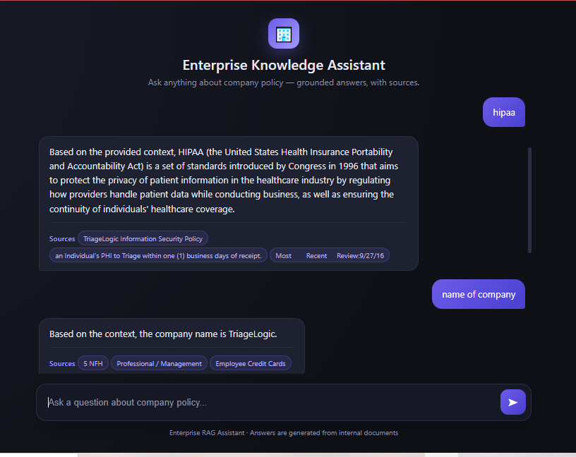

# 🏢 Enterprise Knowledge Assistant (RAG System)

A production-style Retrieval-Augmented Generation (RAG) system that lets users ask natural language questions about internal company documents and get accurate, cited answers — instead of manually searching through long PDFs.

Built end-to-end: document ingestion → hybrid retrieval → reranking → LLM generation → REST API → containerized deployment.

---

## ✨ Features

- **Multi-format document ingestion** — PDF, DOCX, Excel, and web pages
- **Structure-aware chunking** — splits documents by section/heading instead of blind character counts, preserving context
- **Hybrid search** — combines keyword search (BM25) with semantic search (embeddings) for more accurate retrieval
- **Reranking** — a cross-encoder model re-scores retrieved chunks to surface the most relevant ones before generation
- **Query rewriting** — vague or short user queries are automatically expanded into clearer search queries
- **Conversation memory** — follow-up questions ("What about its penalties?") are resolved using chat history
- **Input guardrails** — blocks prompt-injection style queries before they reach the LLM
- **Grounded answers with citations** — every answer includes the source section it came from, and the system explicitly says "I don't have enough information" instead of hallucinating
- **API authentication** — endpoints are protected with API key auth
- **Simple web chat interface** — no separate frontend framework needed

---

## 🏗️ Architecture

```
Document (PDF/DOCX/XLSX/URL)
        │
        ▼
Document Loader ──▶ Structure-Aware Chunking ──▶ Embeddings (Sentence Transformers)
                                                          │
                                                          ▼
                                                    FAISS Vector Store
                                                          │
User Query ──▶ Query Rewriting ──▶ Hybrid Retrieval (BM25 + Semantic) ──▶ Reranking (Cross-Encoder)
                                                                                │
                                                                                ▼
                                                                     LLM Generation (Gemini)
                                                                                │
                                                                                ▼
                                                                     Answer + Source Citations
```

---

## 🛠️ Tech Stack

| Layer | Technology |
|---|---|
| Language | Python |
| API Framework | FastAPI |
| LLM | Google Gemini |
| Embeddings | Sentence Transformers (`all-MiniLM-L6-v2`) |
| Vector Store | FAISS |
| Keyword Search | BM25 |
| Reranking | Cross-Encoder (`ms-marco-MiniLM-L-6-v2`) |
| Document Parsing | LangChain, Unstructured |
| Containerization | Docker |
| Frontend | Vanilla HTML/CSS/JS |

---

## 🚀 Getting Started

### Prerequisites
- Python 3.11+
- A Google Gemini API key ([get one here](https://aistudio.google.com))
- Docker (optional, for containerized run)

### Local Setup

```bash
# Clone the repo
git clone https://github.com/madeel0a1/enterprise-rag-assistant.git
cd enterprise-rag-assistant

# Create virtual environment
python -m venv venv
venv\Scripts\activate      # Windows
# source venv/bin/activate # Mac/Linux

# Install dependencies
pip install -r requirements.txt

# Add your environment variables
# Create a .env file with:
#   GEMINI_API_KEY=your_key_here
#   AUTH_API_KEY=your_chosen_api_key

# Add a company document
# Place a PDF named Company.pdf in the project root

# Run the server
uvicorn main:app --reload
```

Visit `http://127.0.0.1:8000` for the chat interface, or `http://127.0.0.1:8000/docs` for the interactive API docs.

### Run with Docker

```bash
docker build -t enterprise-rag .
docker run -p 8000:8000 enterprise-rag
```

---

## 📡 API

**POST** `/ask`

Headers: `X-API-Key: <your_key>`

```json
{
  "question": "What is the HIPAA compliance policy?"
}
```

Response:
```json
{
  "answer": "HIPAA is a set of standards...",
  "sources": ["TriageLogic Information Security Policy", "HIPAA Compliance Policy"]
}
```

---

## 📊 Evaluation

The system was evaluated using an LLM-as-judge approach — comparing generated answers against known ground-truth answers and scoring accuracy on a 1–10 scale. This surfaced real retrieval weaknesses (e.g., short factual queries like "Who is the CEO?" initially underperforming due to query rewriting drifting from the document's actual wording), which were then debugged and fixed.

---

## 🔮 Possible Future Improvements

- Per-user session isolation for conversation memory
- Cloud deployment (e.g., Render, AWS)
- Automated RAGAS-based evaluation pipeline
- Support for larger document sets with a managed vector DB (e.g., Pinecone)

---

## 📄 License

This project is for educational and portfolio purposes.
